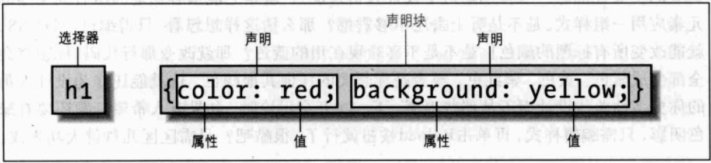
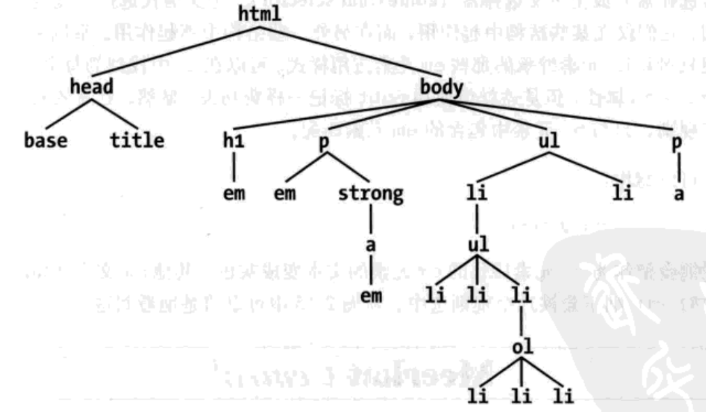
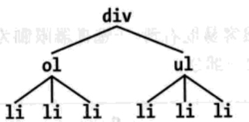

# CSS 权威指南

> 层叠样式表(Cascading Style Sheets, CSS) 的功能非常强大，可以影响一个或一组文档的表现。显然，如果不存在某种文档，CSS基本毫无用处，因为这样一来他将没有要表现的内容。当然，“文档”的定义相当宽泛。

##  1、 CSS和文档

### 元素

- 替换元素： 如 `img`

- 非替换元素 : 如 `span`、段落、标题、表单元格、列表和XHTML

- 块级元素 ： 如 `p div`,块级元素生成一个元素框，(默认地)它会填充其父元素的内容区。替换元素可以是块级元素，不过通常都不是。

- 行内元素 ： 如 `a strong em`,行内元素在一个文本行内生成元素框，而不会打断这行文本。

|	#########  | display 				|
|------------|:-----------------------------:|
| 值 				 | `none`、 `inline`、 `block`、 `inline-block`、 `list-item`、 `run-in`、 `table`、 `inline-table`、 `table-row-group`、 `table-header-group`、 `table-footer-group`、 `table-row`、 `table-column-group`、 `table-column`、 `table-cell`、 `table-caption`、 `inherit` |
| 初始值 		| inline 			 |
| 应用于 		| 所有元素 		  |
| 继承性 		| 无					 |

### link标签

```html
<link rel="stylesheet" type="text/css" href="sheet1.css" media="all" />
```

> 加载外部样式表，`link` 必须放在 `head` 元素中，但不能放在其他元素内部(如： title)。 `.css`扩展名可以不加，但是有些老的浏览器无法通过识别 `link` 元素中 `text/css` 类型来加载 css文件。不过这个问题可以通过改变服务器的配置文件来修正。

- 属性
	- rel: 关系(relation),一般为 `stylesheet`。
	- type: 描述了使用 `link` 标记加载的数据类型, 一般为 `text/css`。
	- href: 可以是样式表的 `绝对URL` 也可以是 `相对URL`。
	- median：
		- all： 用于所有表现的媒体
		- aural： 用于语音合成器、屏幕阅读器和文档的其他声音表现。
		- braille： 用 Braille 设备表现文档时使用。
		- embossed： 用 Braille 打印设备打印时使用。
		- handheld： 用于手持设备,如个人数字助理或支持 web 的蜂窝电话。
		- print： 为视力正常的用户打印文档时使用，另外还会在显示文档的“打印预览”时使用。
		- projection： 用于投影媒体，如发表演讲时显示幻灯片的数字投影仪。
		- screen： 在屏幕媒体（如桌面计算机监视器）中表现文档时使用。在这种系统上运行的所有 web 浏览器都是屏幕媒体用户代理。
		- tty： 在固定间距环境（如电传打字机）中显示文档时使用。
		- tv： 在电视上显示文档时使用。

如果样式表支持多个媒体，各个媒体之间用逗号分隔。例如：

```html
<link rel="stylesheet" type="text/css" href="visual-sheet.css" media="screen,projection" />
```

一个文档可能关联多个链接样式表。文档最初显示时只会使用`rel`为`stylesheet`的`link`标记。浏览器会加载如下两个样式表，合并他们的规则，并将其全部应用于文档。

```html
<link rel="stylesheet" type="text/css" href="basic.css" />
<link rel="stylesheet" type="text/css" href="splash.css" />
```

- 候选样式表

> 还可以定义候选样式表（alternate style sheet）。将 `rel` 属性的值置为 `alternate stylesheet` ，就可以定义候选样式表，只有在用户选择这个样式表时才会用于文档表现。**早期功能，现在大量浏览器已不支持**

不同的设备使用不同的元素

```html
<link rel="stylesheet" type="text/css" href="sheet1.css" media="screen" title="Default" />
<link rel="stylesheet" type="text/css" href="print-sheet1.css" media="print" title="Default" />
<link rel="alternate stylesheet" type="text/css" href="bigtext.css" media="screen" title="Big Text" />
<link rel="alternate stylesheet" type="text/css" href="print-bigtext.css" media="print" title="Big Text" />
```

### style元素

```html
<style type="text/css"></style>
```

`style` 一定要使用 `type` 属性;对于 `CSS` 文档,正确的 `type` 属值是 `"text/css"`,这与 `link` 元素类似。
`style` 元素始终要以 `<style type="text/css"></style>`开头，如上例所示。其后可以有一个或多个样式，最后以一个结束 `</style>`标记结尾。还可以为 `style` 元素指定一个 `media` 属性，其可取值与之前的 `media` 属性值相同。

开始和结束 style 标记之间的样式称为文档样式表(`document style sheet`),或嵌套样式表(`embedded style sheet`), 因为这个样式表嵌套在文档中。其中可能包含应用到文档的多个样式，还可以使用`@import` 指令包含多个外部样式表链接。

### @import指令

常见用例：

```html
<style type="text/css">
	@import url(style.css); /* @import comes first */
	@import url(sheet2.css);
	@import url(blueworld.css);
	@import url(zany.css);
	h1 {color: gray;}
</style>
```

根据不同的媒体应用不同的样式：

```html
<style type="text/css">
	@import url(sheet2.css) all;
	@import url(blueworld.css) screen;
	@import url(zany.css) projection print;
</style>
```

`@import` 加载外部样式表:

```css
@import url(http://example.org/library/layout.css);
```

_注意：_ `@import` 指令出现在样式表的开头，`CSS` 要求 `@import` 指令出现在样式表中的其他规则之前。如果一个 `@import` 出现在其他规则（如 `body {color: red;}`）之后，**兼容用户代理会将其忽略**。

_警告：_ `Windows` 平台的 `Internet explorer`不会忽略任何 `@import`指令，甚至出现在其他规则之后的 `@import`也不会忽略。

### `CSS` 注释

```css
/* 单行注释 */

/* 多行
	注释 */
```

### 内联样式

`style` 属性语法：

```html
<p style="color: gray;">这是一段内联样式</p>
```

_此处 “inline” 不能理解为“行内”，而应当是“内联”，有“内部自带”的意思。_

_注意：_ 一个内联 `style` 属性只能放一个声明块，而不能放整个样式表。因此，不能在 `style` 属性中放 `@import`，也不能包含完整的规则。 `style` 属性的值中只能是规则中出现的大括号之间的部分。**style属性通常不推荐使用，XHTML1.1已将将其标注为不建议使用，XML也不太可能使用这个属性。因为他会抵消一些CSS的优点。**

### 小结

利用 CSS，可能会改变用户代理表现元素的方式。可以使用 `display` 属性采用基本方法来显示，也可以将样式表与文档关联，以另一种不同的方式表现。用户不会知道这是通过外部样式表还是嵌套样式表完成的（甚至有可能是利用一个内联样式做到的）。外部样式表真正的意义在于，她允许创作人员将网站的所有表现信息放在一个位置，将所有文档指向这个位置。这不仅使用网络的更新和维护相当容易，还有助于节省带宽，因为文档中去除了所有表现信息。
为了充分利用 CSS 的强大功能，创作人员需要了解如何将一组样式与文档中的元素相关联。要全面地理解 CSS 如何做到这些，创作人员则需要深入地掌握 CSS 以何种方式选择文档中要应用样式的部分。


## 2、选择器

### 基本规则

将所有`h2`标题变为银色
```css
h2 {color: silver}
```

- 规则结构

每个 css 规则都有两个基本部分： **选择器(selector)** 和 **声明块(declaration block)** 。声明块又一个或多个 **声明(declaration)** 组成，每个声明则是一个属性——值对(proerty-value)。每个样式表由一系列规则组成。下图显示了规则的各个部分。



如上图所示，选择器定义了将影响文档中的那些部分。上图中选择了 `h1` 元素。如果选择器是 `p` ，怎会选择所有 `p` (段落)元素。

- 元素选择器

将 html 标签元素做为 css 的选择器来使用，称为 **元素选择器**

```css
html{color: black;}
h1 {color: gray:}
h2 {color: silver;}
```

- 声明和关键字

如果一个属性的值可以取多个关键字，在这种情况下，关键字通常由空格分隔。并不是所有的属性都能接受多个关键字，不过确实有许多属性是这样的，例如 `font` 属性。假设腰围段落文本定义中等大小的 `Heletica` 字体，写法如下：

```css
p { font: medium Heletica;}
```

注意 `medium` 和 `Helvetica` 之间的空格，`medium` 和 `Helvetica`  都是关键字（`medium` 指定了字体的大小， `Helvetica` 是字体名）。两个关键字之间的空格使用户代理能够区分这两个关键字，并适当地应用。后面的分号指示声明结束。
用空格分隔的这些词称为关键字，这是因别他们加载一起构成了当前属性的值。

<hr />

__注意 :__  CSS 关键字往往由空格分隔，只用一种情况例外，在 CSS 的 `font` 属性中，只有一整情况可以使用斜线 **/** 来分隔两个关键字。如下例：

```css
h2 {font: large/150% sans-serif;}
```
斜线分隔了用来设置元素的字体大小和行高的两个关键字，只用在这里才允许 `font` 声明中出现斜线。 `font` 允许的所有其他关键字都用空格分隔。
<hr />

### 分组

- 选择器分组

将多个元素设置相同的css样式，最直接的方式可能是这样：

```css
h1 {color: purple;}
h2 {color: purple;}
h3 {color: purple;}
h4 {color: purple;}
h5 {color: purple;}
h6 {color: purple;}
```

但是，使用 **分组选择器** 就简单方便多了，如下：

```css
h1, h2, h3, h4, h5, h6 {color: purple;}
```

- 通配选择器

css2 引入了一种新的选择器，称为 **通配选择器(uninersal selector)** ,显示为一个星号。这个选择器可以与任何元素匹配，就像一个通配符。例如，让一个文档中的每一个元素都为红色，可以写为如下规则：

```css
* {color: red;}
```

- 声明分组

假如您需要为一个元素设置浅绿色背景，18像素的 `Helvetica` 字体，文本颜色为紫色。那您就可以使用 **声明分组** 来更方便的的书写样式了：

```CSS
p {
	font: 18px Helvetica;
	color: purple;
	background: aqua;
}
```

__注意 :__ 声明块的最后一定要使用分号结尾，如果缺少分号就会出现各种意想不到的错误。


- 结合 选择器和声明的分组

```CSS
h1, h2, h3, h4, h5, h6 {
	color: purple;
	background: white;
	padding: 0.5em;
	border: 1px solid black;
	font-family: Charcoal, sans-serif;
	}
```

### 类选择器和ID选择器

> 除了指示文档元素的选择器外，还有另外两种类型的选择器： 类选择器(class selector) 和 ID 选择器(ID selector)，他们允许以一种独立于文档元素的方式来指定元素样式。

- 类选择器：

要应用样式而不考虑具体涉及的元素，最常用的方法就是使用类选择器。不过，在使用类选择器之前，需要秀给具体的文档标记，以便类选择器正常工作，驶入以下 class 属性；

```HTML
<p class="waring">这是一段警告文本</p>
<p>这是一段<span class="waring">警告</span>文本</p>
```

对于HTML文档，可以使用一种很简洁的记法，即类名前有一个点号( ```.``` )。

```CSS
.waring {font-weight: bold; color: red;}
```

- ID 选择器：

ID 选择器与 类选择器类似，ID选择器前面有一个 `#` 号 —— 也成为棋盘符。

```HTML
<p id="text-bold">这是一段加粗的文本</p>
```

```CSS
#text-blod { font-weight: bold; }
```

- 类选择器还是ID选择器 ?
	1. ID选择器具有唯一性，使用过一次，别的地方就不能使用了（实际上浏览器并没有检查ID选择器的唯一性）
	2. 不同于类选择器 ID选择器不能结合使用。因为ID选择器不允许有空格分隔的次词列表。
	3. class 名与 ID名之间的另一个区别是，如果你想确定一个给定元素应用那些样式，ID能包含更多含义。
	4. 类和ID选择器都是可能区分大小写的，这取决于文档语言。HTML和XHTML将类和ID定义为区分大小写，所以ID值的大小写必须和文档中的值相对应。( _一些老旧的浏览器可能会不区分类和ID选择器的大小写_ )

### 属性选择器

> 对于类选择器和ID选择器，实际上只能选择属性的值。CSS2 引入了属性选择器( `attribute selector` ), 可以根据元素的数据及数据值来选择元素。  共有四种类型的属性选择器

- 简单属性选择器：

选择某个属性的元素，而不论属性值是什么。可以使用一个简单的属性选择器。例如，要选择有 `class` 属性的所有 `h1` 元素，使其文本为银色，可以写作：

```CSS
h1[cass]{
	color: silver;
}
```

**对所有带 `alt` 属性的图像应用某种样式：**

```CSS
img[alt] {
	border: 3px solid red;
}
```

**把包含标题( `title` )信息的元素变为粗体显示：**

```CSS
*[title] {
	font-weight: bold;
}
```

**根据多个属性进行选择，只需将属性选择器连在一起即可，如：**

```CSS
a[herf][title] {
	font-weight: bold;
}
```

- 根据具体属性值选择：

除了选择某些属性的元素，还可以进一步缩小范围，只选择特定属性的元素。

```CSS
a[herf="https://www.github.com/roy-lau"] {
	font-weight: bold;
}
```

与属性选择器类似，可以把多个属性-值连在一起选择一个文档。

```CSS
a[herf="https://www.w3c.org/"][title="W3C Home"] {
	font-size: 200%;
}
```

**空格问题**

```HTML
<p class="urgent warning">这是一段警告文本！</p>
```

根据具体属性值来选择这个元素，必须写作：

```CSS
p[class="urgent warning"] {
	font-weight: bold;
}
```

下面这两种方式是错误的：

```CSS
p[class="urgent"] {
	font-weight: bold;
}
p[class="warning"] {
	font-weight: bold;
}
```

- 根据部分属性值选择：

如果属性能接受词列表(词之间空格分隔)，可以根据其中任意一个词进行选择。在HTML中，这方面最经典的例子就是 `class` 属性，他能接受一个或多个词做为其属性值。下面是实例文本：

```HTMl
<p class="urgent warning">这是一段文本。</p>
```

假如想选择 `class` 属性为 `warning` 的元素，可以用一个元素选择器做到：

```CSS
p[class~="warning"] {
	font-weight: bold;
}
```

部分值元素选择器不仅可以用于 `class` 也可以用于别的元素,如：

```CSS
img[title="FIgure"] {
	border: 1px solid gray;
}
```

子串匹配选择值：

|类型 							 | 描述
|-------------------|-------------------------------------
| `[foo^="bar"]`		| 选择 `foo` 属性值 以 `bar` 开头的所有元素
| `[foo$="bar"]`		| 选择 `foo` 属性值 以 `bar` 结尾的所有元素
| `[foo*="bar"]`		| 选择 `foo` 属性值中包含子串 `bar` 的所有元素

用例：

```HTML
<span class="barren rocky"> 银色 粗体 </span>
<span class="cloudy barren"> 斜体 </span>
<span class="life-bearing cloudy"> 斜体 粗体 </span>
```
```CSS
span[class*="cloud"] { font-style: italic; }
span[class^="bar"] { background: silver; }
span[class$="y"] { font-weight: bold; }
```

- 特定属性选择类型:

```CSS
*[lang|="en"] { color: white; }
```

这个规则会匹配等于 `en` 或以 `en` 开头的所有元素。因此，以下元素中前三个元素会被选中，而后两个不会被选中。

```HTML
<h1 lang="en"> Hello </h1>
<p lang="en-us"> Gettings </p>
<div lang="en-au"> G'day </div>
<p lang="fr"> Bonjour </p>
<h4 lang="cy-ea"> Jrooana </h4>
```

一般来说， `[att|="val"]` 可以用于任何属性及值，假设一个 HTML 文档中国有一些列图片，其中每个图片的文件名形如 `figure-1.gif` 和 `figure-2.jpg`。就可以选择一下选择器匹配所有这些图像：

```CSS
img[src|="figure"] {border: 1px solid gray;}
```

### 使用文档结构

> CSS功能很强大，因为他要通过 HTML 的结构来确定适当的样式，并确定如何应用这些样式。还不仅如此，因为这说明使用文档结构是CSS确定和应用样式的唯一途径，确定以何种方式项文档应用样式时，结构还承担着重要的角色。下面先来讨论结构，然后在介绍些功能刚强大的选择器。

- 理解父子关系

要理解选择器和文档的关系，需要先分析文档结构。考虑下面非常简单的HTML文档：

```html
<!DOCTYPE html>
<html lang="en">

<head>
    <base href="http://www.meerkat.web/" />
    <title>文档关系</title>
</head>

<body>
    <h1>Meerkat<em>Contral</em></h1>
    <p>Welcome to Meerkat <em>Central</em>, the <strong>best meerkat web site on <a href="inet.html">the <em>entire</em> Internet</a></strong>!</p>
    <ul>
        <li>We offer:
            <ul>
                <li><strong>Detailed information</strong>on how to adopt a meerkat</li>
                <li>Tips for living with a meerkat</li>
                <li><em>Fun</em>thing to do with a meerkat, including:</li>
                <ol>
                    <li>Playing fetch</li>
                    <li>Digging for food</li>
                    <li>Hide and seek</li>
                </ol>
						</ul>
        </li>
        <li>... and so much more!</li>
    </ul>
    <p>Questions? <a href="mailto:suricate@meerkat.web">Contact us!</a></p>
</body>

</html>
```

**css之所以强大，在于元素之间存在父子关系。** HTML文档以一种层次结构为基础（实际上，大多数结构化文档都是如此），可以从文档的“树”视图中了解到这种层次结构。在这个层次结构中，每个元素在整个文档结构中都有自己的一个位置。文档中每个元素要么是某个元素的父元素，要么是某个元素的父元素。而且通常兼而有之（即同时作为元素的父元素，和另一个元素的子元素）。



- 后代选择器

理解结构模型后，第一个好处就是定义后代选择器（descendant selector，也成为包含选择器）或者上下文选择器（contextual selector）。定义后代选择器是来创建一些规则，它们仅在某些结构中起作用，而另外一些结构中不起作用。举例来说，假设你希望只对 `h1` 元素继承的那些 `em` 元素应用样式。可以在 `h1` 中找到每个 `em` 元素上放一个 `class` 属性，但这就想使用 font 标记一样费工夫。显然，更高效的做法是声明一些规则，只与 h1 元素包含的 `em` 元素匹配。

为此，可以写作：

```CSS
h1 em { color: gray;}
```
这个规则会把 `h1` 后代的 `em` 元素的文本变成灰色、其他 `em` 文本（如段落或块引用中的 em）则不会被这个规则选中。

后代元素选择器有一个常被忽略的方面，即两个元素之间的层次间隔可以是无限的。例如，如果写作 `ul em` ,这种语法就会选择继承 `ul` 下的所有 `em` 元素，而不论 `em` 元素嵌套有多深。因此， `ul em` 将会选择以下标记中的 `em` 元素:

```HTML
<ul>
	<li>List Item 1
		<ol>
			<li>List Item 1-1</li>
			<li>List Item 1-2</li>
			<li>List Item 1-3
				<ol>
					<li>List Item 1-3-1</li>
					<li>List Item <em>1-3-2</em></li>
					<li>List Item 1-3-3</li>
				</ol>
			</li>
			<li>List Item 1-4</li>
		</ol>
	</li>
</ul>
```

- 选择子元素

某些情况下不想选择任意的后代元素，而是想缩小范围。值选择另一个元素的子元素。例如，你可以选择只作为 `h1`元素的子元素(而不是后代元素)的 `strong` 元素。为此,可以使用子结合符,即大于号 `>`

```CSS
h1 > strong { color: red; }
```
这个规则会把第一个 `h1` 下的 `strong` 变为红色，而第二个出现的 `strong` 元素不受影响。

- 选择相邻的兄弟元素

要去除紧接在一个 `h1` 元素后出现的段落（`p`）上边距，可以写作：

```CSS
h1 + p { margin-top: 0;}
```
这个选择器读作 “选择紧接在一个 `h1` 元素后出现的段落, `h1` 要与 `p` 元素拥有共同的父元素”

为了形象的展示选择器是如何工作的,最容易的办法是再来考虑一个文档树的片段。

想要正常的工作,CSS要求两个元素按“源顺序”出现。在前面例子中， ol 元素后面有一个 ul 元素。因此可以用 `ol+ul` 选择第二个元素,但这个语法无法选择第一个元素。想要与 `ul+ol` 匹配, 有序类别必须紧跟在无序列表后面。
另外，两个元素之间的文本内容不会影响相邻兄弟结合符起作用。上图与下面代码片段相同：

```HTML
<div>
	<ol>
		<li> List item 1 </li>
		<li> List item 2 </li>
		<li> List item 3 </li>
	</ol>这是一些文本，是'div'的一部分
	<ul>
		<li> a list item </li>
		<li> another list item </li>
		<li> yet another list item </li>
	</ul>
</div>
```
尽管两个列表间多了一行文本,不过还是可以用选择器 `ol+ul` 来匹配第二个列表。这是因为中间文本并不包含在兄弟元素中，而只是父元素 div 的一部分,不过也可以这么写：
```CSS
l + p + ul
```

相邻兄弟选择器还可以结合其他结合符:
```CSS
html > body table + ul {margin-top: 1.5em;}
```
这个选择器解释为“选择一个紧挨在 `table` 后出现的所有兄弟 `ul` 元素,改 `table` 元素包含在一个 `body` 元素中,  `body` 元素本身是 `HTML` 元素的子元素”

_警告：windows平台的ie6之前的浏览器不支持子选择器和相邻元素选择器，ie7 则对二者提供了支持。_

### 伪类和伪元素 [参考链接](https://developer.mozilla.org/zh-CN/docs/Learn/CSS/Introduction_to_CSS/Pseudo-classes_and_pseudo-elements)

> 伪类选择器和伪元素选择器可以在文档中不一定具体存在的结构指定样式,或者为某些元素(甚至是元素本身)的状态的幻象类所指定样式,换句话说：会根据另外某种条件而非文档结构，向文档中的某部分添加样式。而且无法通过研究文档的标记准确地推断采用何种方式应用样式。

> 听上去好像在随机应用样式, 不过并非如此。事实上这是根据某种无法提前预测的暂时条件来应用样式。

- 1、伪类选择器

	CSS 定义了伪类，使已使用的锚点有一个 `visited`, 用法如下：
	```CSS
	a:visited{ color: red; }
	```

	已访问页面的锚都会为红色，不必为任何锚点加 `visited` 属性。 注意规则中的冒号 `:` 。分隔 `a` 和 `visited` 是伪类和伪元素的 “名片”。所有伪类和伪元素关键字前面都有一个冒号。

	* 链接伪类

	| 伪类名		 		| 描述
	|---------------|----------
	| 	`:link`			| 指示做为超链接（既有一个 `herf` 属性）,并指向一个未访问地址的所有锚。_注意:有些浏览器可能会不正确的将 `:link` 解释为任何超链接,包括已访问的和未访问的超链接_
	| 	`:visited`	| 指示做为已访问地址超链接的所有锚

	表中的第一个伪类看起来有些多余。毕竟,如果一个锚点尚未访问过,那么他肯定是为访问的链接。如果这样我们需要的应该是：

	```CSS
	a{color: blue;} /* 所有的a标签，包括没有href链接的*/
	a:visited{color: red;}
	```
	尽管这种个是看上是合理的。但是，第一个规则不仅应用到未访问的链接,还会应用到一下锚点：
	```HTML
	<a name="section4"> 4. The Lives of Meerkats </a>
	```
	上面相对应的文本也会变成蓝色, `a` 元素与规则 `a { color: blue; }` 匹配。所以为了避免将链接样式应用到目标锚，要使用 `:link` 伪类。
	```CSS
	a:link{color: blue;} /* 未访问的链接是蓝色的 */
	a:visited{color: red;} /* 访问的链接是红色的 */
	```
	* 动态伪类
	> css2.1 定义了3个动态伪类，他们可以根据用户的行为改变文档的外观。这种动态伪类以前总用来设置超链接样式，不过他们还有很多其他用途，见下表：

	| 伪类名 			| 描述
	|-------------|---------
	| 	`:focus`		| 指示当前输入焦点的元素，也就是说，可以使用键盘输入或者以某种方式激活的元素。
	| 	`:hover`		|	指示鼠标停留在哪个元素上，例如，鼠标可能停留在一个超链接上,    `:hover` 就会指示这个超链接
	| 	`:active`		| 指示用户被输入激活的元素，例如，鼠标停留在一个超链接上时，如果用户点击鼠标，就会激活这个超链接， `:active` 将指示这个超链接。

	常用伪类实例：
	```CSS
	a:link{color: navy;}
	a:visited:{color: gray;}
	a:hover{color: red;}
	a:active{color: yellow;}
	```
	**注意**： 伪类顺序很重要，这一点最初可能不太明显。通常建议是“`link -> visited -> hover -> active`”,不过现在已经改为“`link -> visited -> focus-> hover -> active`”

	* 选择一个子元素

	静态伪类`:first-child`可以选择元素的第一个子元素。用例如下：
	```HTML
	<div>
		<p> These ate the necessary steps:</p>
		<ul>
			<li>Insert key</li>
			<li>turn key <strong>clockwise </strong></li>
			<li>Push accelerator </li>
		</ul>
		<p>Do <em>not</em> push the brake at the same time as the accelerator </p>
	</div>
	```
	```CSS
	p:first-child{font-weight: bold;} // 第一个 p 元素 粗体
	li:first-child{text-transform: uppercase;} // 第一个 li 元素转为大写
	```
	_警告：windows平台的ie6不支持 `:first-child`,不过ie7支持。_

	* 根据语言选择

	`:lang()` 伪类可以根据元素的语言来选择
	```HTML
	<p lang="fr">我写的这段是法文！</p>
	```
	```CSS
	p:lang(fr){ font-style: italic; } // 将法文改为斜体
	```

	* 结合伪类

	一个选择器可以使用多个伪类，例如
	```CSS
	a:link:hover {color: red;}
	a:visited:hover {color: maroon;}
	```
	指定的顺序并不重要；将`a:hover:link`写成`a:link:hover`效果是一样的。但是，不要把互斥的伪类结合在一起使用。例如，一个链接不能同时是已访问和未访问的，所以`a:link:visited`没有任何意义。用户代理往往会忽略这个选择器，相应的忽略整个规则，不过这一点不能保证，因为不同的浏览器可能有不同的错误处理行为。

	警告： ie6中对于 `a:link:hover`会理解为 `a:hover`,以为ie6不能识别 `:link`伪类。ie7中不存在这种限制。

- 2、伪元素选择器

	伪元素能从文档中插入假想的元素,从而得到某种效果。CSS2.1 中定义了4个为元素：设置首字母样式,设置第一行样式,设置之前和之后样式。

	* 设置首字母样式

	第一个伪元素用于设置一个块级元素首字母的样式,而且仅对首字母设置样式
	```CSS
	p:first-letter { color: red; }  // 将 p 元素的第一个字母设置为红色
	```

	* 设置第一行的样式

	`:first-line` 可以用来影响元素的第一行文本。例如可以让文本的第一段第一行变为紫色
	```CSS
	p:first-line { color: purple; }
	```
	这个样式应用于每一段所显示的第一行文本。不论区域多大或多小，都是如此。如果第一行只包含该段的5个词，那么只有这5个词会变成紫色。如果第一行包含该段的30个词，那么这30个词就会变成紫色。

	**`:first-letter` 和 `:first-line` 限制**

	在 CSS2 中 `:first-letter` 和 `:first-line` 只能用于标记或段落之类的块级元素,而不能应用于超链接的行内元素。在 CSS2.1 中 `:first-letter`能应用到所有元素。不过能应用 `:first-letter` 和 `:first-line` 的 CSS 属性还有一些限制。

	伪类所允许的元素：
	| `:first-letter` 								| 	`:first-line` 									|
	|---------------------------------|------------------------------------|
	| 所有 `font` 属性 									 | 所有 `font` 属性
	| `color`														| `color`
	| 所有 `background` 属性						 | 所有 `background` 属性
	| 所有 `margin` 属性								 | `word-spacing`
	| 所有 `padding` 属性								 | `letter-spacing`
	| 所有 `border` 属性 								 | `text-decoratin`
	| `text-decoratin`									| `vertical-align`
	| `vertical-align`(如果`float`设置为`none`)	| `text-transform`
	| `text-transform` 									| `line-height`
	| `line-height`											| `clear`(仅适用于CSS2,CSS2.1已去除)
	| `float`														| `text-shadow`(仅适用于CSS2)
	| `letter-spacing`(CSS2.1中新增)		|
	| `word-spacing`(CSS2.1中新增)			|
	| `clear`(仅适用于CSS2,CSS2.1已去除) |
	| `text-shadow` (仅适用于CSS2)			|

	另外，所有伪元素必须放在出现改伪元素的选择器的最后边。因此，如果写成`p:first-letter em` 就是不合法的。因为伪元素在选择器主体前面出现(主体是指这里所列的最后一个元素，即 `em`)。这个规则同样适用于 CSS2.1 定义的另外两个伪元素。

	* 设置之前和之后的元素样式

	假设想设置一种排版效果，在所有 h2 前面加一对银色的括号:
	```CSS
	h2:before { content: "}}"; color: silver; }
	```
	CSS2.1 允许插入生成的内容,然后使用伪元素 `:before` 和 `:after` 直接设置样式。

	伪元素用于插入生成的内容，并设置其样式。要在一个元素后面插入内容,可以使用伪元素 `:after`,可以在文档最后用一个适当的结束语。
	```CSS
	body:after { content: " The End.";}
	```

### 小结

通过根据文档语言来使用选择器，可以创建非常丰富的 CSS 规则。我们可以构建只应用于少数元素的简单规则。对大量类似元素应用样式也同样简单。由于可以对选择器和规则分组，这样使样式表相当简洁，而且非常灵活，响应的可以缩小文件大小。缩短下载时间。

用户代理通常慎用选择器，因为如果不能正确地解释选择器,会导致用户代理根本无法使用CSS。另一方面，创作者应该正确地编写选择器，这很关键。因为一旦出错,用户代理将无法安预想的那样应用样式。要想正确地理解选择器以及如何组合选择器，需要深入的掌握选择器与文档结构的关系,并了解继承和层叠等机制在确定如何为元素设置样式时有怎样的作用。

## 3、结构和层叠

> 文档结构和CSS选择器可以为元素应用丰富的样式，每个合法的文档都会生成一个结构树。了解这一点，就能根据元素的祖先、属性、兄弟元素等等，创建选择器来选择元素。有了这个结构树，选择器才能起作用。这也是 **CSS另一个重要的方面（即继承）的核心** 。

  **继承(Inheritance)** 是从一个元素向其后代元素传递属性值所采用的的机制。确定应当向一个元素应用那些值时，用户代理不仅会考虑继承，还会考虑声明的特殊性，另外需要考虑声明本身的来源。这个过程称之为 **层叠(cascade)**。三种机制之间的关联性：**特殊性，继承和层叠**

> 不管怎么样无论看起来多么抽象，多么难懂，都要继续努力。你的努力不会白费！

### 特殊性

**特殊性(specificity)** 对于每个规则，用户代理会计算选择器的特殊性，并将特殊性附加到规则中的各个声明。如果一个元素有两个或多个冲突的属性声明，那么特殊性高的属性声明就胜出。

_注意:_ 这并不是解决冲突的全部。事实上，所有样式冲突都是由层叠来处理的。

选择器的特殊性由选择器本身的组件来确定。特殊性表述为4个部分，如：`0,0,0,0`。一个选择器具体特殊性如下确定：

- 对于选择器中给定的各个ID属性，加 `0,1,0,0`
- 对于选择器中给定的各个类属性、属性选择器或伪类，加 `0,0,1,0`
- 对于选择器中给定的各个元素和伪元素，加 `0,0,0,1` 。_伪元素是否有特殊性？在这方面CSS2有些自相矛盾，不过CSS2.1很清楚的指出，伪元素有特殊性，而且特殊性为 0,0,0,1_
- 结合符合通配符对特殊性没有任何贡献

例如：以下规则中选择器的特殊性见注释

```CSS
h1 {color: red;}							/* specificity 0,0,0,1 */
p em {color: purple;}							/* specificity 0,0,0,2 */
.grape {color: purple;}						/* specificity 0,0,1,0 */
*.bright {color: yellow;}					/* specificity 0,0,1,0 */
p.bright em.dark {color: maroon;}	/* specificity 0,0,2,2 */
#id216 {color: blue;}							/* specificity 0,1,0,0 */
div#sidebar *[href] {color: blue;}	/* specificity 0,1,1,1 */
```

实际上，特殊性值  `0,0,1,0` 比值 `0,0,0,13` 更高。之所以会这样，是因为值是从左向右排序的。特殊性值 `1,0,0,0` 大于以 0 开头的所有特殊性值。而不论后面的数是什么。

#### 声明和特殊性

任何情况下，用户代理都会确定哪些规则与一个元素匹配，计算出所有相关的声明及其特殊性，确定哪些规则胜出，然后将胜出的规则应用到元素，从而得到应用样式后的结果。每个元素、选择器和声明上都必须完成这个工作。幸运的是用户代理会自动完成这些所有的工作。这个行为是层叠的一部分。

#### 通配选择器特殊性

通配选择器对一个选择器的特殊性没有贡献，换句话说，其特殊性为 `0,0,0,0` 这与根本没有特殊性有区别。因此 给定以下两个规则， `div` 下包含段落将是黑色，而其他元素都是灰色。

```CSS
div p {color: black;} /* 0,0,0,2 */
* {color: gray;} /* 0,0,0,0 */
```

相比之下，结合符则没有任何特殊性，设置连0特殊性都没有。因此，他们对选择器的总特殊性没有任何影响。

#### ID和属性选择器的特殊性

需要着重指出，ID选择器和指定id属性的属性选择器在特殊性上有所不同。

```CSS
html>body table tr[id="total"] td ul>li {color: maroon;} /* 0,0,1,7 */
li#answer {color: navy;} /* 0,1,0,1 (winner) */
```

第二行规则中的ID选择器(`#answer`)为选择总体贡献了 `0,1,0,0` 而在第一行规则中，属性选择器(`tr[id="total"]`)只对特殊性贡献了 `0,0,1,0` 因此，下面规则中，id为`meadow`的元素将变为绿色

#### 内联样式特殊性

之前讲的都是0开头的特殊性，为什么没有1开头的呢？其实第一个为0是为内联样式保留的，他比其他声明特殊性都高。看以下代码片段：

```CSS
h1 {color: red;}
<h1 style="color:green;">this document title<h1>
```
假设这个规则应用到h1上，h1的文本还将是绿色的，因为每个内联样式的特殊性为 `1,0,0,0`

这意味着，即使id属性与某个规则匹配，也必须遵守内联样式的声明。

__注意:__ 为内联样式声明保留一位，这是CSS2.1才新增的，这样做是为了反应写CSS2.1当时的web浏览器表现。在CSS2中，内联元素的特殊性是 `1,0,0` (CSS2特殊性包含3个值，而不是4个)，所以说，内联样式的特殊性与ID选择器的特殊性相同，所以CSS2中ID选择器很容易覆盖内联样式

#### 重要性

有时某个声明可能非常重要，超过了所有其他声明。CSS2.1 称之为重要声明（原因显而易见），并允许这些声明在结束分号前插入 `!important` 标志。

```CSS
p.dark{color: #333!important; background: white!important;}
```

必须正确的放置 `!important` 否则声明无效。`!important`总是放在声明的最后，既分号前面。如果一个属性的值可以包含多个关键词，如 font，这一点尤为重要，必须将 `!important`标志放在声明的最后：

```CSS
p.light {color: yellow; font:smaller Times, serif !important;}
```
如果`!important`放在font声明的任何其他位置，整个都将无效，相应不会应用任何其他样式。

```CSS
p {color: red!important;}
```
```HTML
<p style="color:blue;">hello everyone!<p>
```
上面段代码的文本颜色为红色，所以 `!important` 的特殊性是大于内联样式的。


### 继承

> 特殊性对理解如何向文档应用声明很重要，同样还有一个很重要的概念，即 **继承**。基于继承机制，样式不仅会应用到指定元素，还会应用到它的后代元素。

例如：如果向一个 `h1` 元素应用一个颜色，那么这个颜色应用到 `h1`中的所有文本，甚至应用到该 `h1` 的子元素中的文本：

```CSS
h1 {color: red;}
<h1>Meerkat <em>Central</em></h1>
```
不仅正常的 `h1` 标签会变色，连 `em` 文本也会变色，因为 `em` 继承了父级的 `color` 值。如果em不能被后代元素继承，则必须单独制定该元素颜色。

继承对无需列表也适用，假设ul元素应用样式 `color:gray;` :
```CSS
ul{ color: gray;}
```

**注意：** 在HTML中有一个例外，应用到 `body` 元素的背景样式可以传递到 `html` 元素(html文档的根元素)，响应的可以定义其画布。

继承是CSS中最基本的内容之一，除非有必要理由，否则一般不会特别考虑。不过，还有几点需要特别记住

首先，注意有些属性不能继承，这往往归结于一个简单的知识。例如，`border`(用于设置元素的边框)就不会继承。

**为什么边框不能继承？**

一般地，大多数框模型属性（包括外边框，内边框，边框和背景）都不能继承，其原因是一样的。毕竟你不希望一个段落中所有链接都从其父元素继承30px的外边距。

继承这个值根本没有特殊性，甚至连0这个特殊性也没有。这看上去似乎只是理论上不同，不过等你了解到继承值没有特殊性会有什么结果时，就知道这种差别决不能忽视。

```CSS
* {color: gray;}
h1#page-title {color: block;}
```
```HTML
<h1 id="page-title">Meerkat <em>Central</em> </h1>
<p>Welcome to the best place on the web for meerkat information! </p>
```

<h4 style="text-algin:center;">继承 Bug </h4>
> 由于不同的浏览器实现中可能存在的问题，开发人员不能指望继承得到所有情况下预想的结果。例如， Navigator 4(另外，从某种程度上将IE4和5)的表不会继承样式。因此，以下规则会导致文档中除表以外的所有文本都会有更小的字体：
```CSS
body {font-size: 0.8em;}
```
> 在CSS中这是不合适的，但这种现象确实存在。所以开发人员都使用以下技巧：
```CSS
body,table,th,td {font-size: 0.8em;}
```

> 如果浏览器本身在继承方面存在bug，在这样的浏览器中，利用上述技巧比较有可能得到所有的结果。不过仍不能保证。
> 遗憾的是正确实现继承浏览器中，以上“修正方法”会导致严重问题，如 `IE5,6，Netscape 6+`等浏览器。在这些浏览器中，最终文本会放在一个表单元格中，其字体大小是用户默认字体大小设置的 `41%`。应当针对更新浏览器编写正确的CSS。相比之下，试图在老浏览器中修改bug的行为通常比较危险。

因为通配选择器适用与所有元素，而且有0特殊性，其颜色声明指定的值 `gray` 要优先于继承值(black),因为继承值根本没有特殊性。因此，em元素显示为灰色而不是黑色。

这个例子生动的说明了不加区别的使用通配选择器可能存在的问题之一，由于他能匹配任何元素，所以通配选择器往往有一种短路继承的效果。这个问题可以解决，不过通常更合理的做法是从一开始就避免不加区别的使用通配选择器，从而从根本上避免这个问题。

继承值完全没有特殊性，这一点很关键，决不能等闲视之。例如：假设一个样式表编写如下，使“工具条”中所有文本都是黑底白字。
```CSS
#toolbar{color:white;background:block;}
```

只要id为 toolbar的元素只包含纯文本而不包含其他元内容，这就能正常起作用。不过，如果这个元素中的文本都是超链接(a元素)，用户代理的超链接样式就会占上风。在一个web浏览器中。这意味着他们的颜色很可能是蓝色，因为浏览器样式表很可能包含以下规则：
```CSS
a:link{color: blue;}
```

为了克服这个问题，必须如下声明：
```CSS
#toolbar {color: white; background:black;}
#toolbar a:link{color: white;}
```

### 层叠

如果特殊相等的两个规则同时应用到同一个元素会怎么样？浏览器如何解决这样的冲突？假设：
```CSS
h1 {color: red;}
h1 {color: blue;}
```

这两个规则的特殊性都是 `0,0,0,1`,所以他们的权重是相等的，都应当应用到元素。但这是不可能的，因为元素不可能即使红色又是蓝色；

“层叠样式表”这个名字可能会提供一些提示。CSS锁基于的方法就是样式层叠在一起，这个通过结合继承和特殊性做的。CSS2.1的层叠规则相当简单：

1. 找出所以的相关规则，这些规则都包含于一个给定元素匹配的选择器。
2. **按显示权重** 对应到该元素的所有声明排序，标志 `!important`的规则权重高于没有标志 `!important` 的规则。按来源对应到给定元素的所有声明排序，共3种来源：**开发人员，读者，用户代理**。正常情况下开发人员的样式要胜过读者的样式。有 `!important` 的读者样式要强于所有其他样式，还包括 `!important`标志的开发人员样式。创作人员样式和读者样式都比用户代理的默认样式权重高。
3. **按特殊性** 对应用到给定元素的所有声明排序。有较高特殊性的元素权重要大于有较低特殊性的元素。
4. **按出现顺序** 对应用到给定元素的所有声明排序。一个声明在样式表或文档中越后出现，它的权重越大。如果样式表中有导入样式，一般认为出现在导入样式表中的声明在前，主样式表中的声明在后。

#### 按权重和来源排序

> 根据第二条规则，如果两个样式规则应用到同一元素，而且其中一个规则有 `!important` 标志，这个重要规则将胜出：

```CSS
p {color:gray !important;}
```
```HTML
<p sytle="color: block;">Well, <em>hello</em> there! </p>
```
尽管段落都style属性指定了一个颜色，不过CSS有 `!important` 标志的规则会胜出，所有段落为灰色，em 元素也会继承灰色。

另外，还要考虑规则的来源。如果一个元素于开发人员样式表中的正常权重样式匹配，另外还与读者样式表中的正常权重匹配，则会使用开发人员的样式。例如,假设以下样式本别来自注释中指定的来源：

```CSS
p em {color: black;} /* author's style sheet (开发人员)  winner */
p em {color: yellow;} /* reader's style sheet (读者) */
```

在这种情况下，段落中强调文本为黑色，而不是黄色，因为正常权重的开发人员要优先于正常权重的读者样式。不过，如果两个规则都标志有 `!important` 就有所不同了：

```CSS
p em {color: black !important;} /* author's style sheet (开发人员)   */
p em {color: yellow !important;} /* reader's style sheet (读者) winner */
```
现在段落文本中的强调是黄色而不是黑色。

一般情况下，用户代理的默认样式（通常受用户首选项影响）也要考虑在内。默认样式声明在所有样式声明中影响是最小的，因此，开发人员定义一个规则到锚，则该规则会覆盖用户代理的默认样式。

总结一下: 在声明权重方面考虑5级。权重由大到小依次为：

1. 读者的重要声明
2. 开发人员的重要声明
3. 开发人员的正常声明
4. 读者的正常声明
5. 用户代理声明

_开发人员通常只需要考虑前四种权重级别，因为任何声明都会胜过用户代理样式。_

#### 按特殊性排序

根据第三条规则，如果向一个元素应用多个彼此冲突的声明，而且他们权重相同，则要按特殊性排序，最特殊的声明最优先。例如：

```CSS
p#bright {color: silver;}
p {color: black;}
```
```HTML
<p id="bright">Well, hello there! </p>
```
给定以上所示规则，段落文本将是银色，为什么呢？因为 `p#bright` 的特殊性 `0,1,0,1` 大于 p 的特殊性 `0,0,0,1` 尽管最后一条规则在样式表中较后出现。

较高的特殊强于较低的特殊性。


#### 按顺序排序

最后，根据第四条规则，如果两个规则权重、来源和特殊性完全相同，那么样式表中后出现的一个会胜出。因此，下面的例子在文档样式表中可以看到以下规则：

```CSS
h1 {color: red;}
h1 {color: blue;}
```

下面第二个规则会胜过导入的规则，因为第二个规则是文档表的一部分。

```CSS
p em {color: purple;}  /* from imported style sheet */
p em {color: gray;}  /* rule contained within the document */
```

根据层叠的第四条规则，认为元素style属性中指定的样式位于文档样式表的最后，即放在所有其他规则的后面。不过这一点没有实际意义，因为在CSS2.1中内联样式声明的特殊性要高于所有样式表选择器。

**注意：** 要注意CSS2中内联样式与ID选择器的特殊性相等。在CSS2（而非CSS2.1）用户代理中，认为style属性声明出现在文档样式表的最后，并且与样式表中所有其他声明一样，按权重、来源、特殊性、和顺序排序。

正是由于这种按顺序排序，所以才有了通常推荐的链接样式顺序。一般建议按 **link-visited-hover-active(LVHA)**的顺序声明链接样式如下：
```CSS
:link {color: blue;}
:visited {color: purple;}
:hover {color: red;}
:active {color: orange;}
```

#### 非CSS表现提示

文档中可能包含非CSS表现提示，例如 font 元素。非 CSS 提示被处理为特殊性为0，并出现在开发人员的样式表的最前面。只要有开发人员或读者样式，这种表现提示就会被覆盖。但用户代理样式不能将其覆盖。

### 小结

层叠样式表中最基础的一章就是层叠—— 冲突的声明要通过这个过程排序，并由此确定最终的文档表示。这个过程的核心是选择器及其相关声明的特殊性，以及继承机制。

## 4、值和单位

> 在利用CSS能做的几乎所有工作中，最基础的是单位(units),这是影响所以属性颜色、距离和大小的一种元素。如果没有单位，就不能声明某个段落为紫色，或者某个图像周围应该有10像素的空白，也不能声明一个标题的文本大小。如果理解了这个概念就能很快的解决CSS余下的内容。

### 数字

CSS中有两类数字： 整数（完整的数）和实数（小数）。这些数字类型主要作为其它值类型的基础，不过在某些情况下，这些基本类型数字也可以作为属性的值。
在CSS2.1中，实数定义为一个整数可以根有一个小数点和小数部分。因此，以下都是合法的数字值：15.5、-270.000004和5，整数和实数都可以是正数或负数，不过属性可能（而且通常）会限制所允许的数字范围。

### 百分数

百分数是一个计算得出的实数，其后根有一个百分号（%）。百分数值几乎总是相对于另一个值，这个值可以是任意的；可能是同一元素另一属性的值，也可以是从父元素继承的一个值，或者祖先元素的一个值。接受百分数值的属性会对所允许的百分数值定义某些限制，还会定义百分数计算到什么程度。

### 颜色

> 每一位web开发者最早提出的问题可能是：“怎么在页面上设置颜色？” 使用HTML时，你有两个选择： 可以按名使用为数不多的几种颜色，如 red 和 purple ；或者可以采用一种不那么一目了然的方法，即使用十六进制代码。这两种描述颜色的方法在CSS中仍然保留，另外还提供一些其他的描述方法，而且新增的方法更为直观。

#### 颜色命名

假设从一个很小的颜色集中选择就足够了，那么最容易的办法就是使用颜色名。CSS称这些有名字的颜色为命名颜色（道理很简单）。

合法命名颜色关键字很有限。例如：你不能选择 “mother-of-pearl”，因为只不是一个已定义的颜色名。在CSS2.1中，CSS规范定义了17个颜色名。这包括 HTML4.01中定义的16个颜色名，并外加一个橙色：

||||||
|-|-|-|-|-|
| aqua (青色) | fuchsia (紫红色) | lime (酸橙) | olive (橄榄) | red (红色) |
| white (白色) | black (黑色) | gray (灰色) | Maroon (栗色)| orange (橙色) |
| silver (银) | yellow (黄色) | blue (蓝色) | green (绿色) | navy (海军) |
| purple (紫色) | teal (鸭翅绿) |

因此，如果希望一级标题是紫色，最简单的声明是：
```CSS
h1 {color: maroon;}
```

web浏览器能识别多达140个颜色名，包括前面的17种基础颜色。另外这里颜色都在CSS3颜色规范中定义,CSS3中包含140中颜色的扩展颜色表基于标准 X11 RGB值，X11 RGB值已经使用十多年了，所以这些颜色能够得到很好的支持。

幸运的是，CSS还有一些更详细、更精确的方法用于指定颜色值。其好处在于,采用这些方法可以指定色谱中的任何颜色，而不是17中或140中命名颜色。

#### 用RGB指定颜色

> 计算机通过组合红色，绿色，蓝色的分量来创造颜色,这种组合通常称为RGB颜色。实际上,如果拆开一个老旧的CRT计算机显示器,在向下“挖掘”就能找到显像管，会发现三支“枪”,这些枪会在屏幕的各个点上发射不同强度的电子束。然后在屏幕的这些点上结合各个光束的强度,构成各种颜色。各个点就称为像素（pixel）。当前大多显示器并不使用电子枪,但是其颜色输出还是以RGB混合为基础。

> 根据显示器上创建颜色的方式，可以直接访问这些颜色,有你来确定如何分配红、绿、蓝分量,从而最大程度地控制颜色。这种解决方法很复杂，不过的确可以,而且是值得的，这样一来,对于能够产生哪些颜色几乎没有什么限制。可以采用4中方法以这种方式控制颜色。

* 函数式RGB颜色

	有两种颜色值类型使用函数时RGB记法而不是十六进制记法。这种类型颜色值的一般语法是rgb(color),其中color用百分数或整数三元组表示。百分数值在 0%~100&范围之内,整数范围为255。

	因此，使用百分数记法分别制定白色和黑色,值将制定为：
	```
	reg(100%,100%,100%)  // 黑
	reg(0%,0%,0%) 				// 白
	```
	使用整数三元记法,相同颜色表示如下：
	```
	rgb(255,255,255) // 黑
	rgb(0,0,0)				// 白
	```

* 十六进制RGB颜色

	CSS允许使用HTML web开发人员很熟悉的十六进制颜色记法来定义颜色：
	```CSS
	h1 {color: #FF0000;} /* 设 h1 为 红色 */
	h1 {color: #903BC0;} /* 设 h1 为 暗紫色 */
	h1 {color: #000000;} /* 设 h1 为 黑色 */
	h1 {color: #808080;} /* 设 h1 为 中灰色 */
	```

	其工作原理：将三个介于00~FF的十六进制数连起来,就可以设置一种颜色。这种记法一般语法是 #RRGGBB。 注意，在这三个之间没有逗号，空格或其他分隔符。

	十六进制记法在数学上等价于整数三元组记法。例如：rgb(255,255,255) 就完全等价于 #FFFFFF,而rgb(51,102,128)则与 #336680 完全相同。完全可以使用你想用的任何记法,无论哪一种记法,大多数用户代理给出的表示都是相同的。

	如果组成的十六进制数的3组数各自都是成对的,CSS还允许使用一种简单的记法。这种记法一般语法是#RGB：
	```CSS
	h1 {color: #000;} /* 设 h1 为 黑色 */
	h1 {color: #666;} /* 设 h1 为 深灰色 */
	h1 {color: #FFF;} /* 设 h1 为 白色 */
	```
	浏览器会取每一位，并将其复制为两位。因此, #F00 等价于 #FF0000 。

* 颜色汇总

	对于之前讨论的所有颜色，在下表中做了个总结。浏览器可能无法识别这些颜色的关键字,因此，为了更为安全,要用RGB或十六进制三元组值来定义。另外，有些写法十六进制中根本不会出现,这种情况下,采用标准记法的较长值（6位）不能简写为三位,因为这些值不能进行复制。例如,值 #880会扩展为 #888800 ,而不是 #808000(即olive),因此 #808000没有简写版本。

	等价颜色表：
	|#| 颜色 	|	百分数 | 数值	| 十六进制 | 简写十六进制 |
	|-|-------|--------|-----|---------|-------------|
	|1| red 	|	rgb(100%,0%,0%) | rgb(255,0,0)	| #FF0000 | #F00 |
	|2| orange|	rgb(100%,40%,0%) | rgb(255,102,0)	| #FF6600 | #F60 |
	|3| yellow|	rgb(100%,100%,0%) | rgb(255,255,0)	| #FFFF00 | #FF0 |
	|4| green |	rgb(0%,50%,0%) | rgb(0,128,0)	| #008000 | 			 |
	|5| blue |	rgb(0%,0%,100%) | rgb(0,0,255)	| #0000FF | #00F |
	|6| aqua |	rgb(0%,100%,100%) | rgb(0,255,255)	| #00FFFF | #0FF |
	|7| black |	rgb(0%,0%,0%) | rgb(0,0,0)	| #000000 | #000 |
	|8| fuchsia |	rgb(100%,0%,100%) | rgb(255,0,255)	| #FF00FF | #F0F |
	|9| gray |	rgb(50%,50%,50%) | rgb(128,128,128)	| #808080 |  |
	|10| lime |	rgb(0%,100%,0%) | rgb(0,255,0)	| #00FF00 | #0F0 |
	|11| maroon |	rgb(50%,0%,0%) | rgb(128,0,0)	| #800000 |  |
	|12| navy 	|	rgb(0%,0%,50%) | rgb(0,0,128)	| #000080 |  |
	|13| olive 	|	rgb(50%,50%,50%) | rgb(128,128,0)	| #808000 |  |
	|14| purple |	rgb(50%,0%,50%) | rgb(128,0,128)	| #800080 |  |
	|15| silver |	rgb(75%,75%,75%) | rgb(192,192,192)	| #C0C0C0 |  |
	|16| teal 	|	rgb(0%,50%,50%) | rgb(0,128,128)	| #008080 |  |
	|17| white	|	rgb(100%,100%,100%) | rgb(255,255,255)	| #FFFFFF | #FFF |


* web安全色

	所谓256个“web安全色”是指,在256色计算机系统上总能避免抖动的颜色。web安全色可以表示为RGB值20%和51(相应的十六进制值为33)的倍数。另外，0%和0也是一种安全值。因此如果使用RGB百分数,要让所有这3个分量都要么是0%,要么是一个能被20整除的数,例如rgb(40%,100%,80%)或者(60%,0%,0%)。如果使用0~255范围的RGB值,则各分量的值要么是0要么是能被51整除的数,如rgb(0%,204%,103%)或rgb(255,0,102)。

	采用十六进制记法，使用值00、33、66、99、CC和FF的三元组都认为是web安全的。这种例子有 #669933、#00CC66和#FF00FF,这说明,文本安全色的简写十六进制值是0、3、6、9、C和F;因此#693、#0C6和#F0F都是web安全色的例子。

### 长度单位

很多CSS属性(如外边距)都依赖于长度度量来适当地显示各种页面元素。因此,CSS中有很多度量长度的方法不足为奇。

所有长度单位都可以表示为正数或负数，其后跟一个表签（不过有些属性只接受正数）。另外也可以接受实数，也就是有小数部分的数,如10.5或4.561。所有长度单位后面都有一个两个字母缩写,它表示所有指定的具体长度单位,如in(英寸)或pt(点)，这个规则只有一个例外,就是长度为0时，其后不需要跟单位。

这些长度单位可以归为两类： **绝对长度** 和 **相对长度** 单位。

#### 绝对长度

绝对长度单位有五种，如下：
1. 英尺(in)

	这种记法是美国国尺子上都有的单位:英尺（全世界都在使用米制的今天，规范中居然还有这个单位，由此可见美国对Internet的影响之大）

2. 厘米(cm)

	这是指全世界尺子上都有的单位:厘米。1 英寸是 2.54厘米, 1厘米等于0.394英寸。

3. 毫米(mm)

	10毫米等于1厘米，所以1英寸等于25.4毫米,1毫米等于0.0394英寸。

4. 点(pt)

	点是一个标准印刷度量单位,在打印机和打字机上已经使用了数十年，另外字处理程序使用 **点** 做为处理程序也是很多年了。以往，一英寸是72点（点是米制单位广泛使用之前定义的）。因此，如果文本首字母设置为12点，就是一英寸的1/6高。例如`p{font-size: 18pt;}` 等价于 `p{font-size: 0.25in;}`。

5. 派卡(pc)

	派卡(pica)也是一种应刷术语。1派卡相当于12点,这意味着，6派卡等于1英寸。

当然，只有浏览器知道用来显示页面的显示器、所用的打印机或者其他任何用户代理的所有细节,这些单位才真正有用。在一个web浏览器上，显示会受显示器的尺寸所影响（另外所设置的显示器分辨率也会有影响）——做为开发人员，对于这些因素你往往无计可施。你只希望这些度量之间相互是一致的,也就是说设置为 1.0in 将是 0.5in 的两倍大。

* 处理绝对长度单位

假设计算机相当了解其显示系统,可以准确地在现真实世界的度量。在这种情况下,通过声明 `p{margin-top: 0.5in;}` 可以确信每个段落的上边框都是半英寸。不论字体大小,也不管任何其他情况,段落的上边框都是半英寸。

绝对单位在定义打印文档样式表时更有用，再次可以通过英寸，点和派卡来度量长度。可以看到，在web中试图使用绝对单位往往不是最佳做法,所以下面来看一些更有用的度量单位。

#### 相对长度
* em和ex单位
* em和ex实际问题

#### 像素长度
* 像素理论
* 如何取舍

### URL

#### 关键字
* inherit


### CSS2单位

### 小结