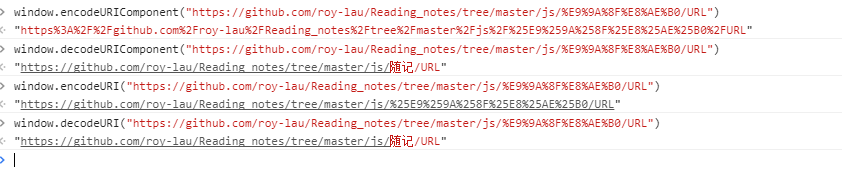

## 		 		JavaScript中url的四种编码函数

<br />
> 统一资源标识符，或叫做 URI，是用来标识互联网上的资源（例如，网页或文件）和怎样访问这些资源的传输协议（例如，HTTP 或 FTP）的字符串。除了encodeURI、encodeURIComponent、decodeURI、decodeURIComponent四个用来编码和解码 URI 的函数之外 ECMAScript 语言自身不提供任何使用 URL 的支持。


### 1. encodeURI 编码

`encodeURI()`是`JavaScript`中真正用来对URL编码的函数。

它着眼于对整个URL进行编码，因此除了常见的符号以外，对其他一些在网址中有特殊含义的符号```“; / ? : @ & = + $ , #”```，也不进行编码。编码后，它输出符号的utf-8形式，并且在每个字节前加上%。

该方法不会对 ASCII 字母和数字进行编码，也不会对这些 ASCII 标点符号进行编码： - _ . ! ~ * ' ( ) 。

该方法的目的是对 URI 进行完整的编码，因此对以下在 URI 中具有特殊含义的 ASCII 标点符号，encodeURI() 函数是不会进行转义的：;/?:@&=+$,#

如果 URI 组件中含有分隔符，比如 ? 和 #，则应当使用 encodeURIComponent() 方法分别对各组件进行编码。

`encodeURI`对应的解码函数是`decodeURI()。`

需要注意的是，它不对单引号```' ```编码。


### 2. encodeURIComponent 解码

该方法不会对 ASCII 字母和数字进行编码，也不会对这些 ASCII 标点符号进行编码： - _ . ! ~ * ' ( ) 。
其他字符（比如 ：;/?:@&=+$,# 这些用于分隔 URI 组件的标点符号），都是由一个或多个十六进制的转义序列替换的。

请注意 encodeURIComponent() 函数 与 encodeURI() 函数的区别之处，前者假定它的参数是 URI 的一部分（比如协议、主机名、路径或查询字符串）。因此 encodeURIComponent() 函数将转义用于分隔 URI 各个部分的标点符号。


### 3. decodeURI 编码

`decodeURI()` 函数可对 `encodeURI()` 函数编码过的 URI 进行解码。


### 4. decodeURIComponent 解码

最后一个`Javascript`编码函数是`encodeURIComponent()`。与`encodeURI()`的区别是，它用于对URL的组成部分进行个别编码，而不用于对整个URL进行编码。

因此，`“; / ? : @ & = + $ , #”`，这些在encodeURI()中不被编码的符号，在`encodeURIComponent()`中统统会被编码。至于具体的编码方法，两者是一样。


> 所有主要浏览器都支持 encodeURIComponent() 函数


##### URL四种编码演示




