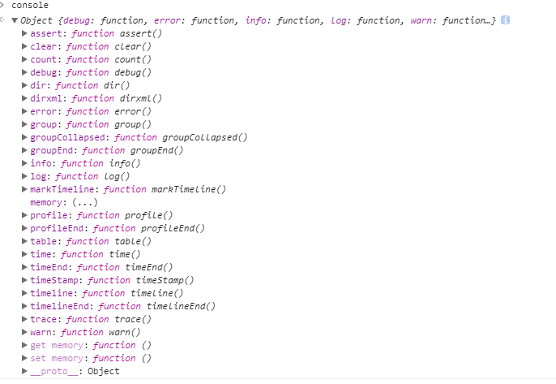
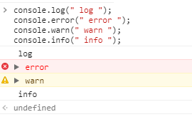
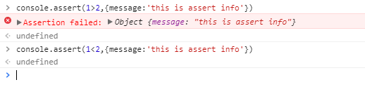
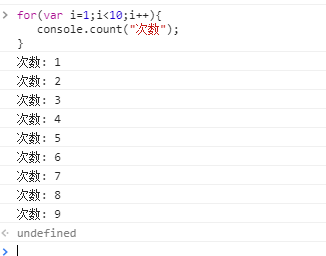
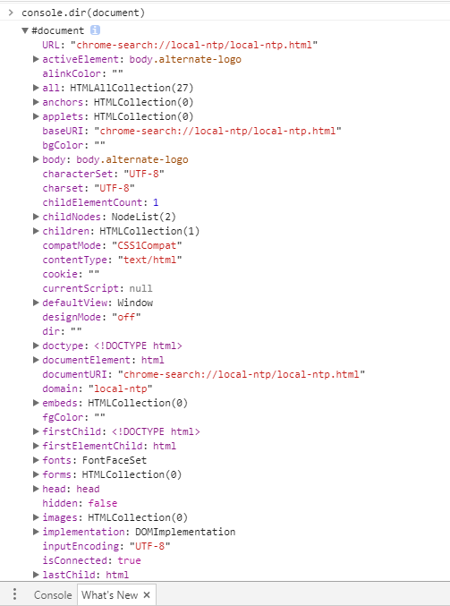
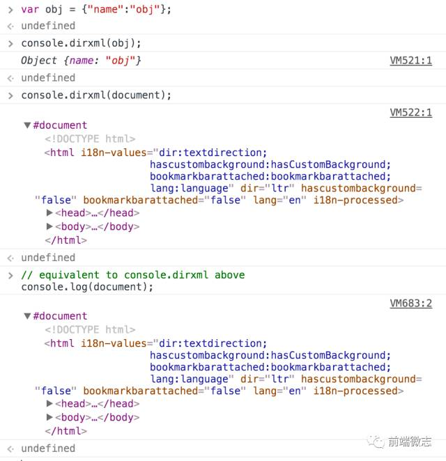
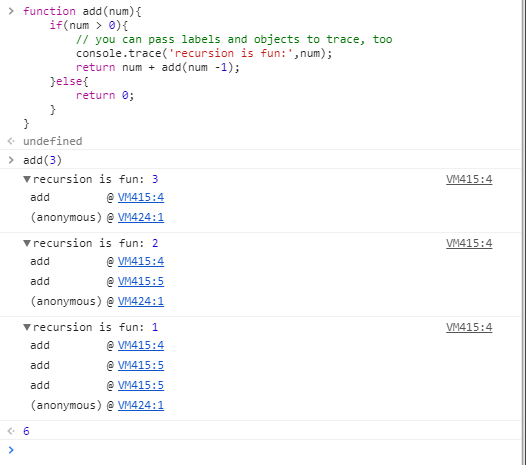

# 你不知道的console

### All




### type

> console.log(), console.error(), console.warn(), console.info()



### 断言(assert)

```javaScript
console.assert(expression, message)
```
> 参数：
> expression: 条件语句，语句会被解析成 Boolean，且为 false 的时候会触发message语句输出
> message: 输出语句，可以是任意类型




### 计数(count)

```javaScript
console.count(label)
```

> 参数：
> label: 计算数量的标识符



### 目录(dir)

```javaScript
console.dir(object)
```

> 参数：
> object：被输出扎实的DOM对象



### xml目录(dirxml)

```javaScript
console.dirxml(object)
```

>该函数将打印输出XML元素及其子孙后代元素，且对HTML和XML元素调用 console.dirxml() 和 调用 console.log() 是等价的。



### 开始时间：console.time([label])，结束时间：console.timeEnd([label])

> label: 用于标记计时器的名称，不填的话，默认为 default

> console.time() 会开始一个计时器，并当执行到 console.timeEnd() 函数时（需要两个函数的lable参数相同），结束计时器，并将计时器的总时间输出到控制台上。

```javaScript
	console.time();
	var arr = new Array(10000);
	for (var i = 0; i < arr.length; i++) {
	  arr[i] = new Object();
	}
	console.timeEnd();
	// default: 3.696044921875ms
```

> 对 console.time(label) 设置一个自定义的 label 字段，并使用console.timeEnd(label) 设置相同的 label 字段来结束计时器。

```javaScript
	console.time('total');
	var arr = new Array(10000);
	for (var i = 0; i < arr.length; i++) {
	  arr[i] = new Object();
	}
	console.timeEnd('total');
	// total: 3.696044921875ms
```

> 设置多个 label 属性，开启多个计时器同步计时。

```javaScript
	console.time('total');
	console.time('init arr');
	var arr = new Array(10000);
	console.timeEnd('init arr');
	for (var i = 0; i < arr.length; i++) {
	  arr[i] = new Object();
	}
	console.timeEnd('total');
	// init arr: 0.0546875ms
	// total: 2.5419921875ms
```

### 追踪(trace)

```javaScript
console.trace(object)
```

> 该函数将在控制台打印出从 console.trace() 被调用的位置开始的堆栈信息。

